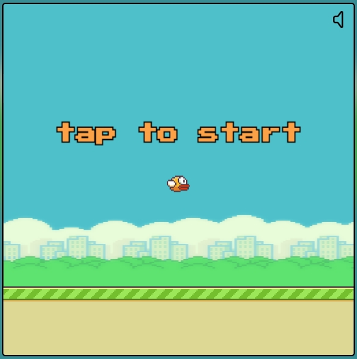

# Flappy Bird Clone

Welcome to the Flappy Bird Clone project! This is a recreation of the classic Flappy Bird game using the PixiJS. This README will provide you with an overview of the project structure, features, and instructions on how to run the game.

## Overview

This project is a simple implementation of the Flappy Bird game using PixiJS, HTML, and CSS. The game replicates the fundamental gameplay mechanics found in the original Flappy Bird. The player controls a bird and navigates it through gaps between pipes. The game includes a score counter, obstacles, and the ability to save the player's high score. Additionally, players can view their gameplay statistics after each round and toggle sound effects on/off.

## Features

- Flappy Bird gameplay mechanics.
- PixiJS for smooth graphics rendering.
- Score counter to keep track of the player's progress.
- Obstacles in the form of pipes to create a challenging environment.
- High score saving functionality.
- Post-game stats display for players to review their performance.
- Sound effects using the PixiJS sound library.
- Basic HTML and CSS for user interface and styling.

## Installation

1. Clone this repository to your local machine using:

```bash
git clone https://github.com/dmromaniv/flappybird-clone.git
```

2. Navigate to the project directory:

## Usage

1. Open the `index.html` file in a modern web browser.
2. Use mouse click to make the bird flap and navigate through the pipes.
3. Avoid collisions with the pipes to keep the game going.
4. The game will end when the bird collides with a pipe or the ground.
5. After each game over, you can view your performance statistics and try to beat your high score.
6. Toggle sound effects on/off using the provided button.



**Enjoy playing Flappy Bird Clone!**

- You can play it **[here](https://dmromaniv.github.io/flappybird-clone/)**.
